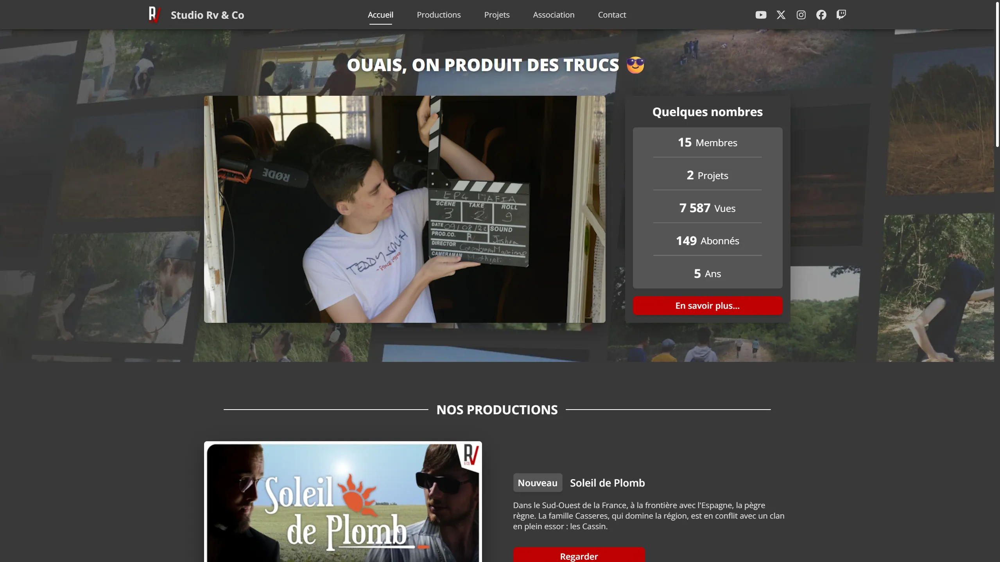

  

  <h1>Website</h1>

  <a href="https://github.com/StudioRvAndCo/Website">Website</a> of the Studio Rv & Co association.  
  <a href="https://rvandco.fr"><b>Visit »</b></a>

  

    
  

## ⭐️ Features

- 🖼️ Show productions, projects and members of the association
- ⚙️ Show social networks data
- 🗣️ English and French translations
- 📱 Responsive

## 📚 Tech Stack

- [Astro](https://astro.build/)
- [Sass](https://sass-lang.com/)
- [Iconify](https://iconify.design/)
- [SplideJS](https://splidejs.com/)
- [CountUp](https://github.com/inorganik/countUp.js)
- [Cloudflare Workers](https://workers.cloudflare.com/)
- [Vitest](https://vitest.dev/)

## 🎨 Color Reference

| Color                        | Hex                                                                    | Description                   |
| :--------------------------- | :--------------------------------------------------------------------- |:----------------------------- |
| Text color                   |  `#FFFFFFFF` | Titles and subtitles          |
| Subtext color                |  `#DFDFDFFF` | Texts and description         |
| Button background color      |  `#BE0000FF` | Background for buttons        |
| Background color             |  `#393939FF` | Global background             |
| Projects background color    |  `#555555FF` | Background for other projects |
| Association background color |  `#612626FF` | Background for association    |

## ⚙️ Scripts

This project use [pnpm](https://pnpm.io) as package manager.
You can also use [npm](https://www.npmjs.com) but you have to edit commands from documentation to make it work properly.

| Command           | Action                                         |
| :---------------- | :--------------------------------------------- |
| `pnpm install`    | Installs dependencies                          |
| `pnpm dev`        | Starts local dev server at `localhost:4321`    |
| `pnpm check`      | Scan source files for warnings and errors      |
| `pnpm test`       | Run unit tests                                 |
| `pnpm coverage`   | Preview code coverage from unit tests          |
| `pnpm build`      | Build your production site to `./dist/`        |
| `pnpm preview`    | Preview your build locally, before deploying   |
| `pnpm deploy`     | Build and deploy project to Cloudflare Workers |
| `pnpm cf-typegen` | Update .env IntelliSense autocompletion        |

## 💼 License

GNU AGPLv3 © [Mathis Serrieres Maniecki](https://github.com/Minarox)
